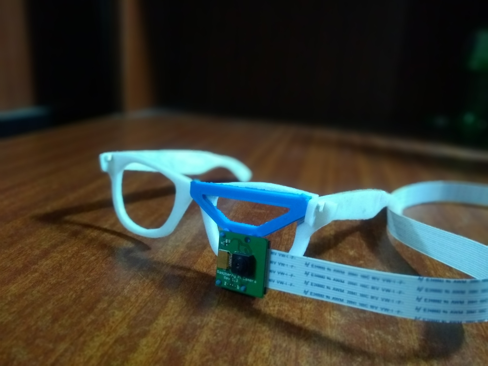

# NETRA

Netra is wearable device that helps visually impaired people navigate by providing speech descriptions of the world around them. This repository implements Netra Daemon that runs on a Raspberry Pi device connected to the standard PiCamera module. To provide real-time environment descriptions Netra-Daemon needs a Netra Vision server running on a computer. Netra Vision implements a Convolutional-Recurrent Neural network that converts images to text descriptions. 
Rest of the modules requre Google Vision API authentication to work.

#### Netra Prototype Implementation



### Setup

#### To use describe mode
1. Start the Netra Vision Server by following the instructions specified in https://github.com/subho406/Netra-Vision
2. Change the global IP variable in netra_daemon.py to the IP address of the Netra Vision server.

#### To use text, raw and face modes
1. Follow the instructions in https://cloud.google.com/vision/docs/auth to set up Google Vision API authentication.


### Running
```
python3 netra_daemon.py MODE
```


### Available Modes
1. describe: Environment Description 
2. text: Text Recognition 
3. raw: Label and Context Identification 
4. face: Face Detection


### Requirements
1. Google Vision API (Required for text,face and raw modes)
2. Netra Vision Server (https://github.com/subho406/Netra-Vision)


